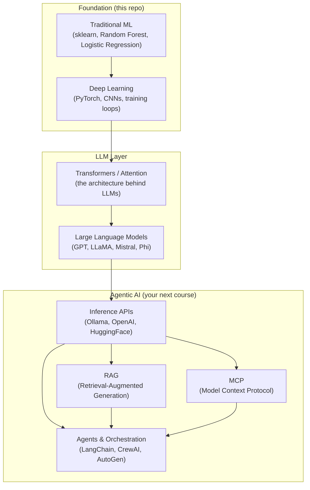

# The AI Landscape — From ML to Agentic AI

Where does everything fit? This is the map.

---

## The Stack (Bottom → Top)



---

## What Each Layer Does

| Layer | What it is | Your role |
|-------|-----------|-----------|
| **Traditional ML** | Algorithms that learn patterns from tabular data (numbers, categories). You engineer features manually. | You learned this in `00_ml101_basic/` and `01_ml101_classification_demo/` |
| **Deep Learning** | Neural networks that learn features automatically from raw data (images, audio, text). Requires GPUs and training loops. | You learned this in `03_ml101_image_classification_demo/` |
| **Transformers** | A specific neural network architecture (2017) that processes sequences using "attention." Powers all modern LLMs. | You do NOT need to build these. Just know they exist. |
| **LLMs** | Transformers trained on billions of text tokens. They predict the next token. GPT-4, LLaMA 3, Mistral, Phi are all LLMs. | You will **use** these, not train them. |
| **Inference APIs** | How you call a pre-trained LLM — via Ollama (local), OpenAI API (cloud), or HuggingFace. | This is your primary interface to LLMs. |
| **RAG** | Feed relevant documents to an LLM at query time so it can answer with your data (not just its training data). | Core pattern you'll build. |
| **MCP** | A protocol that lets LLMs call external tools and data sources in a standardized way. | You'll build MCP servers and connect them to agents. |
| **Agents** | Programs that use LLMs as a reasoning engine, making decisions and calling tools in a loop until a goal is met. | This is the destination — LangChain, CrewAI, AutoGen, custom agents. |

---

## The Key Mental Shift

```
┌─────────────────────────────────────────────────────────┐
│  In this repo:    YOU train small models from scratch    │
│  In Agentic AI:   YOU consume pre-trained LLMs          │
└─────────────────────────────────────────────────────────┘
```

### What you DID here (ML/DL primer):
- Wrote `train.py` → model learned from data → saved `.pkl` / `.pt` file
- Wrote `predict.py` → loaded model → ran inference

### What you'll DO in Agentic AI:
- Download a pre-trained LLM (e.g., `ollama pull llama3:8b`)
- Send it prompts → get responses
- Chain multiple LLM calls into agents
- Give it tools (MCP) and knowledge (RAG)

You skip the "train.py" step entirely. Someone else (Meta, OpenAI, Microsoft) already trained the model on massive GPU clusters for months. **You start at inference.**

---

## Connecting the Dots: Model Files

| In this repo | In Agentic AI |
|-------------|---------------|
| `house_price_rf.pkl` (a few KB) | `llama3-8b.gguf` (4-8 GB) |
| ~6 features, ~1000 parameters | Billions of parameters |
| Trained in seconds on CPU | Trained for months on thousands of GPUs |
| Predicts one thing (house price) | Predicts next token → generates any text |

They're the same concept — saved learned weights — at vastly different scales.

---

## What You DON'T Need for Agentic AI

- ❌ Designing neural network architectures
- ❌ Writing training loops
- ❌ Understanding backpropagation math in depth
- ❌ GPU cluster management
- ❌ Dataset labeling and curation

## What You DO Need

- ✅ Understanding what a model IS (learned weights that map input → output)
- ✅ Understanding inference (input → model → output)
- ✅ Prompt engineering (how to talk to LLMs effectively)
- ✅ RAG (how to give LLMs your data)
- ✅ Tool use / MCP (how to give LLMs abilities)
- ✅ Agent orchestration (how to chain reasoning + actions)
