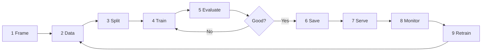
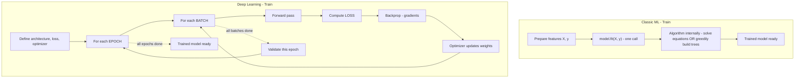

# The Training Process — Classic ML vs Deep Learning

A teaching guide for students. The structure is intentional:

1. First, learn the **9 universal steps** that every ML/DL project follows.
2. Then watch the **same problem** worked through in **Classic ML**.
3. Then watch the **same problem** worked through in **Deep Learning**.
4. Finally, learn the **key vocabulary differences** — epochs, loss, gradients — and what each one's equivalent is on the other side.

---

## 1. The 9 Universal Steps (same for ML and DL)

Whether you build a Random Forest or a giant neural network, the outer shape of the workflow is identical:



| # | Step               | What you do                                                                                | Why it matters                                                              |
| - | ------------------ | ------------------------------------------------------------------------------------------ | --------------------------------------------------------------------------- |
| 1 | **Frame**    | Define the problem: classification, regression, ranking, generation? Pick a target metric. | A wrong frame guarantees a useless model.                                   |
| 2 | **Data**     | Collect, clean, label, deduplicate.                                                        | Models learn from data — bad data, bad model.                              |
| 3 | **Split**    | Carve the data into**train / validation / test** sets.                               | Honest evaluation requires data the model has never seen.                   |
| 4 | **Train**    | Show the data to the algorithm so it can learn patterns.                                   | This is the "learning" part — see §2 and §3 for how it actually happens. |
| 5 | **Evaluate** | Measure accuracy / RMSE / F1 / etc. on held-out data.                                      | Tells you if the model is good enough to ship.                              |
| 6 | **Save**     | Persist the trained model + preprocessing as a single artifact.                            | A model you can't reload is a model you can't use.                          |
| 7 | **Serve**    | Wrap the model in an API, batch job, or edge runtime.                                      | Models only create value when they make predictions in production.          |
| 8 | **Monitor**  | Watch accuracy, latency, data drift, concept drift.                                        | The world changes; models go stale.                                         |
| 9 | **Retrain**  | Refresh the model on new data and redeploy.                                                | Closes the MLOps loop.                                                      |

> **Key idea**: steps 1, 2, 3, 5, 6, 7, 8, 9 look nearly identical for ML and DL. **Step 4 — "Train" — is where the two diverge.** The rest of this document zooms into step 4.

---

## 2. The Same Problem in Classic ML — a worked example

**Problem (frame)**: predict house price (regression) from features like sqft, beds, baths, zipcode.

### Step 2 — Data

A CSV with rows like:

| zipcode | sqft | beds | baths | price      |
| ------- | ---- | ---- | ----- | ---------- |
| 94102   | 1500 | 3    | 2     | $1,200,000 |
| 30316   | 1122 | 5    | 1     | $285,000   |
| …      | …   | …   | …    | …         |

### Step 3 — Split

800 rows for training, 200 rows for testing.

### Step 4 — Train (the Classic ML way)

You pick an algorithm — say **Random Forest**. Training is essentially **one function call**:

```python
from sklearn.ensemble import RandomForestRegressor
model = RandomForestRegressor(n_estimators=100, max_depth=12)
model.fit(X_train, y_train)   # <-- the entire "training" step
```

What is `fit()` actually doing under the hood?

1. It builds **100 decision trees**.
2. Each tree repeatedly asks: *"which feature and which threshold splits the data so the price variance drops the most?"*
3. It greedily picks the best split, then recurses on each side until `max_depth` is reached or splits stop helping.
4. Done. No epochs. No gradients. No learning rate.

**Time**: a couple of seconds on CPU.

### Step 5 — Evaluate

```python
from sklearn.metrics import mean_squared_error, r2_score
preds = model.predict(X_test)
rmse  = mean_squared_error(y_test, preds, squared=False)  # ≈ $100,000
r2    = r2_score(y_test, preds)                            # ≈ 0.99
```

### Step 6 — Save

```python
import joblib
joblib.dump(model, "house_price_rf.pkl")   # a few MB
```

### Steps 7–9 — Serve / Monitor / Retrain

Load the `.pkl` inside a FastAPI endpoint, log predictions, watch RMSE drift, retrain weekly.

**Classic ML takeaway**: you spend your effort on **feature engineering** (creating `price_per_sqft`, encoding zipcode, etc.). Training itself is one fast call.

---

## 3. The Same Shape of Problem in Deep Learning — a worked example

**Problem (frame)**: classify an image as **cat** or **dog**.

You *could* try to use Classic ML here, but you'd have to manually invent features like "fur texture index" or "ear shape descriptor". DL skips that — it learns features from raw pixels.

### Step 2 — Data

10,000 cat photos + 10,000 dog photos, each resized to 64×64 RGB pixels.

### Step 3 — Split

16,000 train / 2,000 validation / 2,000 test.

### Step 4 — Train (the DL way)

You design a small **Convolutional Neural Network (CNN)**:

```python
import torch.nn as nn

model = nn.Sequential(
    nn.Conv2d(3, 32, 3, padding=1), nn.ReLU(), nn.MaxPool2d(2),
    nn.Conv2d(32, 64, 3, padding=1), nn.ReLU(), nn.MaxPool2d(2),
    nn.Flatten(),
    nn.Linear(64 * 16 * 16, 128), nn.ReLU(),
    nn.Linear(128, 2),
)
loss_fn   = nn.CrossEntropyLoss()
optimizer = torch.optim.Adam(model.parameters(), lr=1e-3)
```

Training is **not** one call. It's a **loop**:

```python
for epoch in range(20):                       # <-- 20 EPOCHS
    for x_batch, y_batch in train_loader:     # <-- batches (e.g., 64 images at a time)
        preds  = model(x_batch)               # 1. forward pass
        loss   = loss_fn(preds, y_batch)      # 2. how wrong are we?
        loss.backward()                       # 3. compute gradients
        optimizer.step()                      # 4. nudge weights to reduce loss
        optimizer.zero_grad()                 # 5. clear gradients for next batch
    validate(model, val_loader)               # check val loss each epoch
```

What is this loop actually doing?

1. **Forward pass** — push images through the network, get predictions.
2. **Compute the loss** — a single number measuring "how wrong" the network is on this batch.
3. **Backpropagation** — calculus computes, for every weight, "if I nudge you a little, does the loss go up or down?". That's the **gradient**.
4. **Optimizer step** — Adam uses the gradients to nudge every weight slightly in the direction that **reduces** the loss.
5. Repeat for the next batch. After all batches are done, you've completed **one epoch**. Repeat for many epochs until the validation loss stops improving.

**Time**: minutes to hours on a GPU.

### Step 5 — Evaluate

```python
model.eval()
with torch.no_grad():
    correct = sum((model(x).argmax(1) == y).sum() for x, y in test_loader)
accuracy = correct / len(test_set)   # e.g., 0.92
```

### Step 6 — Save

```python
torch.save(model.state_dict(), "cat_dog_cnn.pt")   # tens of MB
```

### Steps 7–9 — Serve / Monitor / Retrain

Same as ML — wrap in an API, monitor accuracy and drift, retrain. You'll also monitor GPU usage and latency now.

**DL takeaway**: you spend your effort on **architecture design + training recipe** (layers, optimizer, learning rate, augmentation). Training itself is a long loop, not one call.

---

## 4. Key Concepts — DL Term vs ML Equivalent

This is the section students usually find most confusing. Here it is in one table:

| Concept                        | In Deep Learning                                                                                                                                                       | The equivalent (or analog) in Classic ML                                                                                                                                                                                                                                     |
| ------------------------------ | ---------------------------------------------------------------------------------------------------------------------------------------------------------------------- | ---------------------------------------------------------------------------------------------------------------------------------------------------------------------------------------------------------------------------------------------------------------------------- |
| **Epoch**                | One full pass over the training set. You do many (10–1000).                                                                                                           | No direct equivalent.`model.fit()` is called **once**. The analog is "one call to fit", which internally builds all trees / converges the solver.                                                                                                                    |
| **Batch**                | A small chunk of data (e.g., 64 samples) processed before one weight update.                                                                                           | sklearn processes the whole dataset at once (or uses internal mini-batches for `SGDClassifier`/`partial_fit`, but it's hidden).                                                                                                                                          |
| **Iteration / Step**     | One weight update = one batch processed. With 16,000 train samples and batch=64, one epoch = 250 iterations.                                                           | The analog is "one tree built" in a Random Forest, or "one boosting round" in XGBoost.                                                                                                                                                                                       |
| **Loss function**        | A differentiable number measuring wrongness (e.g.,**Cross-Entropy** for classification, **MSE** for regression). The optimizer minimizes it via gradients. | The same concept exists but is often hidden: Linear/Logistic Regression minimizes**MSE / Log-Loss**; Decision Trees minimize **Gini / Entropy / variance reduction** at each split. You just don't write the loop.                                               |
| **Gradient**             | The slope of the loss with respect to each weight; tells the optimizer which way to move.                                                                              | In Logistic Regression / Linear SVM, gradients are computed internally by the solver (L-BFGS, coordinate descent). For tree models, there are**no gradients** — they use greedy splitting (gradient boosting being the exception: it does use gradients of the loss). |
| **Optimizer**            | The algorithm that uses gradients to update weights (**SGD, Adam, AdamW**). You choose it.                                                                       | Hidden inside `fit()`. sklearn picks the solver (e.g., `liblinear`, `lbfgs`) based on the model.                                                                                                                                                                       |
| **Learning rate**        | How big a step the optimizer takes. The #1 hyperparameter.                                                                                                             | No direct knob in trees. In Gradient Boosting it's called the**`learning_rate`** / **shrinkage** — same idea.                                                                                                                                                       |
| **Weights / Parameters** | The millions of numbers inside the network that get tuned.                                                                                                             | The analog:**coefficients** in Linear/Logistic Regression; **split thresholds + leaf values** in trees.                                                                                                                                                          |
| **Backpropagation**      | The chain-rule algorithm that computes all gradients in one backward sweep.                                                                                            | No equivalent — trees don't backpropagate. Linear models compute gradients analytically.                                                                                                                                                                                    |
| **Forward pass**         | Compute the prediction from inputs by running through the layers.                                                                                                      | The equivalent:`model.predict(X)` — apply coefficients or walk down the trees.                                                                                                                                                                                            |
| **Early stopping**       | Stop training when validation loss stops improving.                                                                                                                    | Same idea exists in Gradient Boosting (`early_stopping_rounds`). In Random Forest, you instead cap `n_estimators` and `max_depth`.                                                                                                                                     |
| **Hyperparameter**       | lr, batch size, dropout, depth, optimizer, schedule … (many).                                                                                                         | n_estimators, max_depth, C, kernel … (few). Same concept, smaller surface.                                                                                                                                                                                                  |
| **Regularization**       | Dropout, weight decay (L2), early stopping, augmentation.                                                                                                              | L1 (Lasso), L2 (Ridge), tree pruning,`min_samples_leaf`, `max_depth`.                                                                                                                                                                                                    |
| **Overfitting symptom**  | Train loss keeps dropping, val loss starts rising.                                                                                                                     | Train score is high, test score is much lower.                                                                                                                                                                                                                               |

### 4.1 So what *is* an epoch, in one sentence?

> An **epoch** is one complete pass through the training data so the model can update its weights a little bit. DL needs many epochs because each update is tiny. Classic ML doesn't have epochs because `fit()` either solves the problem in closed form (linear models) or builds the entire model greedily in one pass (trees).

### 4.2 So what *is* a loss function, in one sentence?

> A **loss function** is a single number that says "how wrong is the model right now?", and the entire point of training is to make that number as small as possible. **DL** makes you choose it explicitly (`CrossEntropyLoss`, `MSELoss`, …) and minimizes it step by step. **Classic ML** uses the same idea — Linear Regression minimizes MSE, Logistic Regression minimizes log-loss, decision trees minimize Gini/variance at each split — but it's baked into the algorithm and you rarely touch it.

---

## 5. Side-by-Side Diagram of Step 4 ("Train")



---

## 6. Quick Decision Guide for Students

| If your data is …                                        | Start with …                                               | Why                                                                |
| --------------------------------------------------------- | ----------------------------------------------------------- | ------------------------------------------------------------------ |
| A clean CSV with < 100 columns                            | **Classic ML** (RandomForest, XGBoost)                | Fast, interpretable, strong baseline.                              |
| Tabular but very large (millions of rows × many columns) | **XGBoost / LightGBM**                                | Still classic-ML-style, but scalable.                              |
| Images, video                                             | **DL — CNN or Vision Transformer**                   | Pixels need learned features.                                      |
| Free-form text                                            | **DL — Transformer (BERT-style or LLM)**             | Tokens need learned context.                                       |
| Audio / speech                                            | **DL — CNN/RNN/Transformer on spectrograms**         | Same reason as images.                                             |
| Time series (sensor, finance)                             | **Try classic first**, then RNN/Transformer if needed | Classical methods (ARIMA, gradient boosting) are very strong here. |

---

## 7. Glossary

| Term                              | Meaning                                                               |
| --------------------------------- | --------------------------------------------------------------------- |
| **Epoch**                   | One full pass through the training dataset (DL).                      |
| **Batch**                   | A small subset of samples processed together before a weight update.  |
| **Iteration / Step**        | One weight update = one batch processed.                              |
| **Learning rate (lr)**      | How big a step the optimizer takes when updating weights.             |
| **Loss function**           | A number measuring how wrong the model is on the current batch.       |
| **Gradient**                | The slope of the loss; tells the optimizer which way to move.         |
| **Backpropagation**         | Algorithm that computes gradients through the network.                |
| **Optimizer**               | The rule for using gradients to update weights (SGD, Adam, …).       |
| **Forward pass**            | Computing the prediction by running inputs through the network/model. |
| **Overfitting**             | Model memorizes training data; fails on new data.                     |
| **Underfitting**            | Model is too simple to capture the pattern.                           |
| **Regularization**          | Techniques to discourage overfitting (L1/L2, dropout, …).            |
| **Train/Val/Test split**    | Three disjoint sets: train fits, val tunes, test reports.             |
| **Hyperparameter**          | A setting you choose (lr, depth); not learned.                        |
| **Parameter / Weight**      | A value the model learns during training.                             |
| **Feature engineering**     | Manually creating informative columns from raw data.                  |
| **Embedding**               | A learned dense vector representation of a discrete item.             |
| **Transfer learning**       | Reusing a pretrained model on a new task.                             |
| **Fine-tuning**             | Continuing to train a pretrained model on new data.                   |
| **Data augmentation**       | Synthetic variations of training samples (flip, crop, …).            |
| **Early stopping**          | Stop training when validation loss stops improving.                   |
| **Checkpoint**              | A saved snapshot of model weights (+ optimizer state).                |
| **Inference**               | Using a trained model to make predictions.                            |
| **Drift**                   | When live data or labels diverge from training distribution.          |
| **Precision / Recall / F1** | Classification metrics from the confusion matrix.                     |
| **RMSE / MAE / R²**        | Regression metrics: error magnitude and variance explained.           |

---

## 8. One-Page Summary

- The **9 steps are universal**: frame → data → split → train → evaluate → save → serve → monitor → retrain.
- **Step 4 (Train) is where ML and DL diverge.**
- **Classic ML** = one call to `fit()`. You did the feature engineering up front. No epochs.
- **Deep Learning** = a loop of *epochs × batches × (forward → loss → backward → step)*. The network learns features for you.
- **Epoch** is a DL-only word. The ML analog is "one call to fit / one tree built / one boosting round".
- **Loss function** exists in both, but DL makes it explicit and minimizes it gradient by gradient. ML hides it inside the algorithm.
